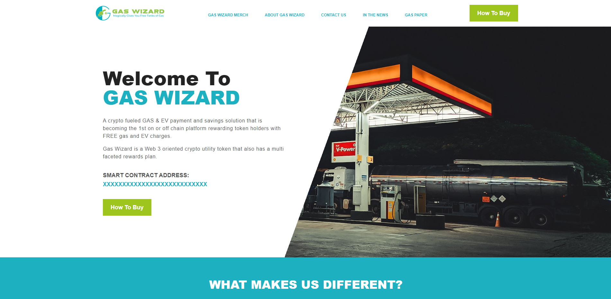

# The Frontend of Gaswizard Finance

## Live site

## Contact info

- **Email:** mr.new0509@gmail.com
- **Telegram:** [@mrnew0509](https://t.me/mrnew0509)
- **Skype:** [@sin085](https://join.skype.com/invite/xat3AgpiRVOI)
- **Discord** [OpenThink#5316](https://discord.gg/TtS7mtuD)

## Release date

Mar 9, 2023

## Last updated at

Mar 9, 2023

## Environment

- `Node.js v18.16.0`

## Stack

- **Framework:** `React.js v18.2.0`
- **Theme:** `Material-Tailwind v1.4.2`

## How to run the project.

1. Please open terminal window in the root directory.
2. Please run command `npm run dev` in it.
